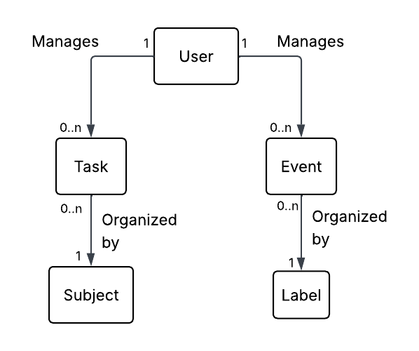
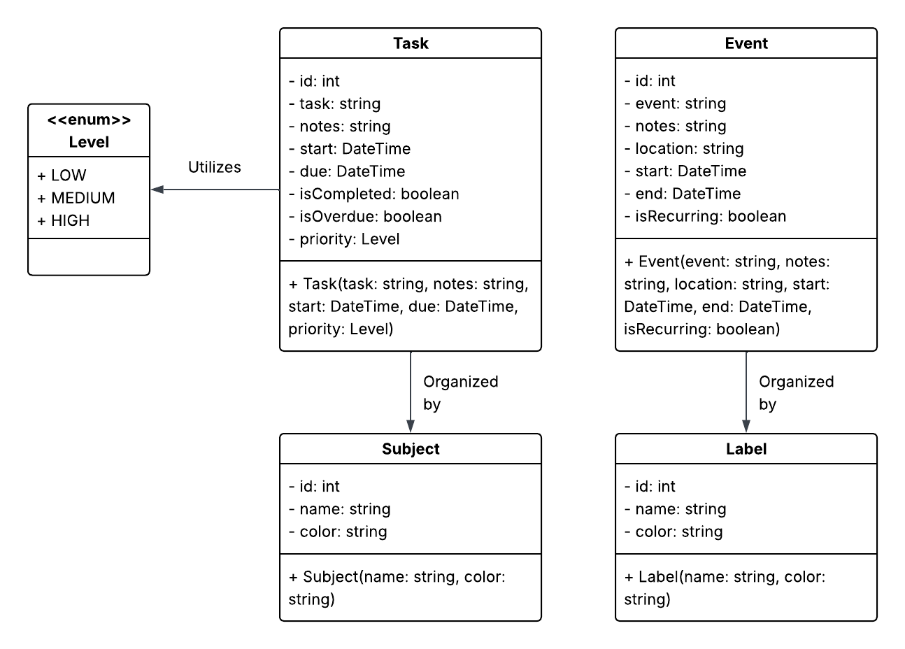

# Task Management App Design Documentation

#### Designed and Programmed by: 
Jayce Fuller

## Executive Summary
This application allows for users to manage their own personal list of tasks and events for any future calendar date. To help users stay on track, tasks can be checked for completion, shifted automatically to the next day if overdue, given a category for easy organization, and set with a priority level. Users can view all their tasks and events for a day in daily view, or see a brief overview in the weekly view.

## Purpose
To create a local, desktop app that provides similar and enhanced features to that of calendar apps. For those who want to distance from larger company calendar apps but still want to manage tasks and events digitially, this app aides in that purpose.

## MVP Features
#### Tasks
 - Create a new task
 - Edit an existing task
 - Mark a task as completed
 - Automatically shift overdue tasks with a notice
 - Sort tasks by user-made subjects
 - View tasks by date
 - View tasks by subject

#### Events
 - Create a new event
 - Edit an existing event
 - View events by date
 - View events in weekly view
 - Sort events by user-made calendar labels
 - Set events to reoccur annually

#### Labels
 - Create labels for tasks and events
 - Delete labels for tasks and events
 - Use for filtering of tasks and events

#### Misc
 - Open app to the current date
 - View the current date in app
 - Search by date to look at events and tasks set in advance for planning
 - Remove tasks and events from past dates to maintain storage

## Architecture and Design

### Domain Model

### Business Layer

